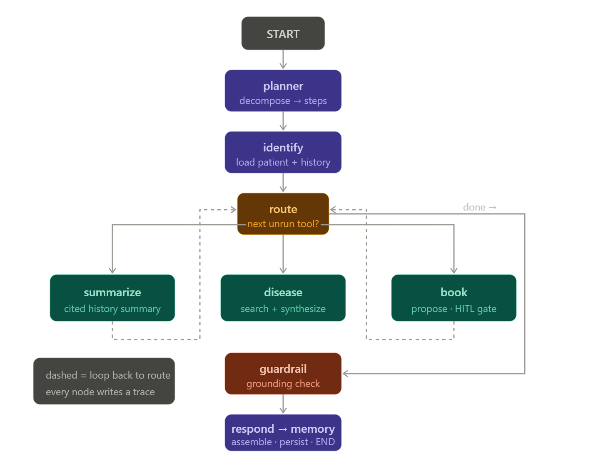
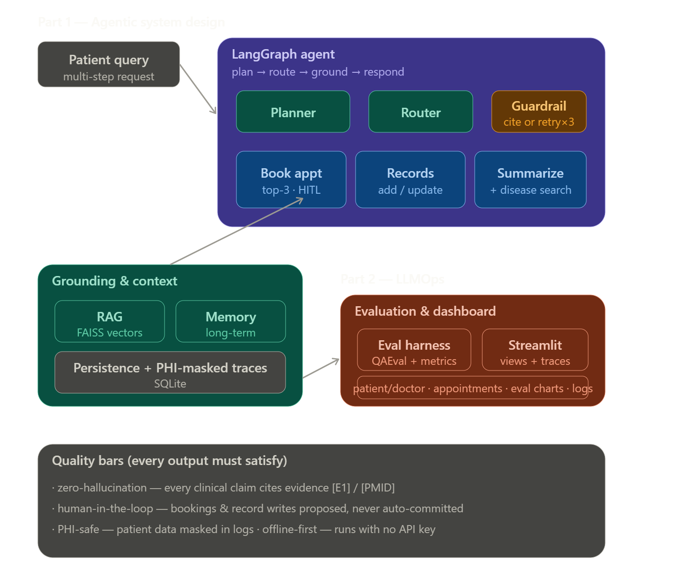
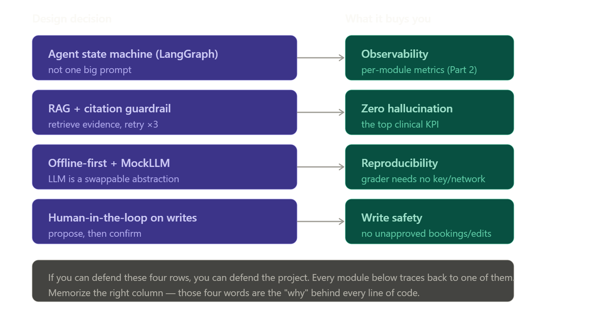

## Design of Agentic Healthcare Assistant for Medical Task Automation

# Problem scenario:
* "In the modern digital health ecosystem, managing patient care involves a range of complex and interdependent tasks. These include appointment scheduling, maintaining patient histories, and retrieving timely disease-related information. Often, healthcare systems rely on siloed tools with limited automation, leading to inefficiencies and fragmented patient experiences.
Agentic AI systems, especially those combining Large Language Models (LLMs) with Retrieval-Augmented Generation (RAG), offer the potential to transform healthcare administration by enabling autonomous coordination of such tasks."

* **What are we building:** ["Build a virtual medical assistant that a. takes a 1. messy, 2. multi-part patient request and *extacts*, *text normalization and text prepocessing for typos, loose syntax and semantics, incorrect grammer, generative error correction, and uses OCR tools if required* ; b. plans the steps itselfs for booking appointment with approprite available doctors, manage patient's records, search disease info, and *grounds* every medical claims in cited evidence, and *remembers using current and history contexts memories* patient context across sessions, and *evaluates* it's own output quality using QAEvalChain or equivalent to assess accuracy and relevance of generated summaries and search results, and surfaces all of it in a *Streamlit* dashboard, and uses *tools* to book appointment, manage records, and search grounded disease info - running off0line first so it with no API key, and also toggle with using API KEY from the UI for patient/admin to accept"]

## Customer/User facing services
# Service 1
    - **Book Medical Appointments:** [" Find available slots of based on patient's intent, purpose, and problem to solve, + appropriate doctor's availability, and recommend top-3, provide best seelcted to the user, and book the user confimed slot"]
# Service 2
    - **Manage Medical Records:** ["Let staff/doctor/admin add/update structured and unstructured patient history"]
# Service 3
    - **Retrieve & Summarize Medical Histories:** ["Summarize past diagnosis, associated treatments, and relevant alerts/actions using LLMs"]
# Service 4
    - **Search Disease Information:** ["Fetch current info from trusted medical healthcare sources (Medline, WHO, PubMed)"]

## Capstone Project Parts

# Part 1 - Agentic Healthcare Assistant System Design
    - ** A Planner:** ["The planner that decomposes a multi-step query into ordered sub-goals and picks the right tool for each (spec item/Service 1)"]
    - ** Tool + Memory Usage:** ["Integrate Apppointment Booking, Medical History Managment with EHR Patient DB, Medical History Search/Report to use LLMs, Disease Search using Web Search APIs/RAG - Bing Seach, Medline, WebMD, WHO; Use FAISS vector DB to store and retrieve patient summaries, session context and long-term memory module/servioce can use MemO or similar (spec/service #2)"]
    - ** Prompt Engineering & Task Chaining:** [" Structured clear crisp per-task tailored prompts, chained as plan, act, summarize, treatment plan, and triggering actions, with patient context injected from patient summary from FAISS, and long-term memory/storage from MemO and Patient DB lookups (spec/service #3)"]
    - ** Search clinical gold standards/authorities for disease specific infomation:** [" Must handle the golden scenario end-to-end (spec/service #4 - example: the CKD/nephrologist query)"]

    
    

# Part 2 - LLMOps
    - ** Model Evaluation:** ["Use QAEvalChain or equivalent, plus per-module performance logging to enable observability and monitoring (booking success rate, response precision, accuracy & consistency)"]
    - ** Memory & logs interface, and Monitoring:** ["monitor, track, detect, and report - memory traces, agent planning breakdowns, AI Agent's performance, halluzinations, precision, accuracy, consistency, iterations, loops, gaurdrails, jailbreaks, token usage/gates"]
    - ** UI & Dashbaord:** [" Streamlit UI - patient/doctor/staff/admin views, appointment booking & tracking, retrived-info display, evalution metrics"]

## Limitations & Constraints
    - ** Zero-hallucination:** ["Every clinical claim must cite evidance ([E1], [PMID:123]), enforced by a guardrail that regenerates upto 3x ('loop break of 3') or appends a caveat"]
    - ** Human-in-the-Loop writes:** ["Never auto-book or auto-write a record - propose with options and risks if applicable, then confirm on human approval"]
    - ** PHI Safery:** ["Patient personal data is masked/redacted in logs; treat everything as PHI as per HIPPA/SOC2"]
    - ** Trust:** ["Trusted sources only for disease info"]
## What's explicitly out of scope (so you don't over-build)
# The reference exceeds the spec on purpose, and your plan correctly fences these as stretch (S1–S3):

    - Clinical-grade risk-weighted evaluation (beyond QAEval) — nice, not required.
    - Mem0/Zep-style adaptive memory (dedup/supersede/consolidate) — the spec just says "retain long-term context"; simple works.
    - RAGAS/DeepEval external benchmarks — opt-in extra.

## Scope System Design Diagram
* 
* 

## Design Notes and ARD

    - ** 1. Why an agent (LangGraph state machine), not a single big prompt?:** ["The spec query is multi-intent, multi-part ('book a nephrologist' and 'summarize treatments') work flow driven by events and state of user/patient query/request as a multi-step transaction. One prompt forces the model to do planing, tool calling, and grounded search all at once - prone for uncontrolled LLM/Agent behaviour, and doesn't provide HITL and also not trackable and verifiable. A state machine makes each step an inspectable/trackable/gaurdrailable node (plan-> indentify -> route -> tool -> guardrail -> respond -> memory), which is also what lets us to log per-module metrics in Part 2 project requirement."]

    - ** 2. Why RAG + citations, not just 'ask the LLM'?:** [ "Healthcare's #1 risk is confident hallucination. RAG retrieves real evidence; the guardrail refuses any claim without a citation marker and regenerates up to 3×. This is the "zero-hallucination" KPI made mechanical]"

    - ** 3. Why offline-first with a MockLLM?:** ["So the app — and its tests — run deterministically with no key/network. This is what makes it reproducible for grading and demoable on a flaky conference Wi-Fi. It also forces a clean abstraction (the LLM is swappable), which is good design on its own.]"

    - ** 4. Why human-in-the-loop on writes?:** [" An agent that auto-books or auto-edits records is a liability. Writes are proposed, a human confirms. This is the "no unapproved writes" guardrail."]

